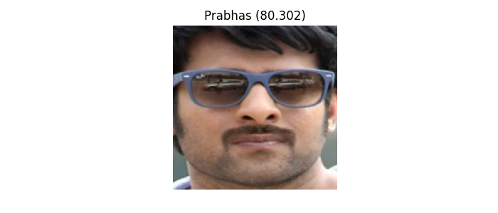
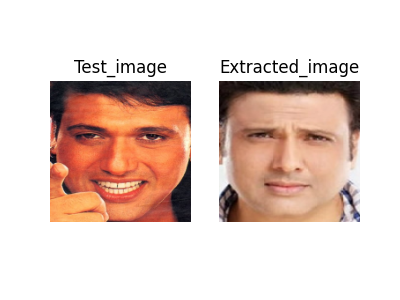
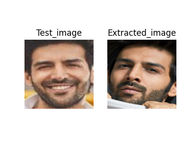
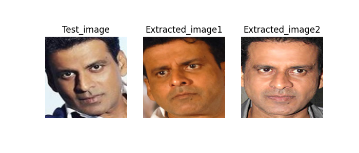

# Face detection using FACENET

This repository contains code for face detection, and retrieval of the most similar face from a database using FaceNet embeddings and Support Vector Machines (SVM) and k-Nearest Neighbors (KNN).  

### The result of Face detection
 
### The results of similar face retrieval 
 

   

  

Dataset:[Bollywood celebrity dataset](https://www.kaggle.com/datasets/havingfun/100-bollywood-celebrity-faces)  

download the faces and embedding array from [here](https://drive.google.com/drive/folders/1jDw5lui7ru3s4Xv9CRFkZfHFdm3j6Jgm?usp=sharing)
