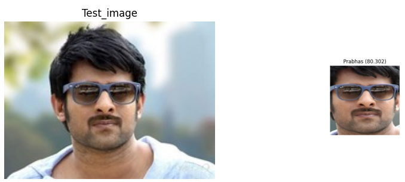
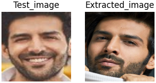

# Face detection using FACENET

This repository contains code for face detection, and retrieval of the most similar face from a database using FaceNet embeddings and Support Vector Machines (SVM) and k-Nearest Neighbors (KNN).  

#### Face detection result

### Most similar face retrieval results
 
   
  

### Applications of repo work
1.Detecting presence of person and counting number of persons in a frame.  

2.Multiclass classification of persons dataset.  

3.Helping a cameraman to extract the photos of a target person from his database.  

4.Fun application is checking checking which celebrity resembles us.

Dataset:[Bollywood celebrity dataset](https://www.kaggle.com/datasets/havingfun/100-bollywood-celebrity-faces)  

download the faces and embedding array from [here](https://drive.google.com/drive/folders/1jDw5lui7ru3s4Xv9CRFkZfHFdm3j6Jgm?usp=sharing)
