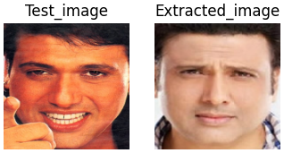
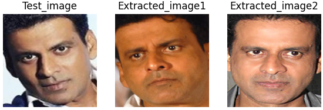

# Face detection using FACENET

This repository contains code for face detection, and retrieval of the most similar face from a database using FaceNet embeddings and Support Vector Machines (SVM) and k-Nearest Neighbors (KNN).  

#### Face detection result

### Most similar face retrieval results
 
   

  

### Applications of repo work
1.Detecting the presence of individuals and counting the number of people in a frame.

2.Performing multiclass classification on a dataset of individuals.

3.Assisting a cameraman in extracting photos of a specific person from their database.

4.A fun application that checks which celebrity bears a resemblance to us.

Dataset:[Bollywood celebrity dataset](https://www.kaggle.com/datasets/havingfun/100-bollywood-celebrity-faces)  

download the face crops and face embedding array from [here](https://drive.google.com/drive/folders/1jDw5lui7ru3s4Xv9CRFkZfHFdm3j6Jgm?usp=sharing)
